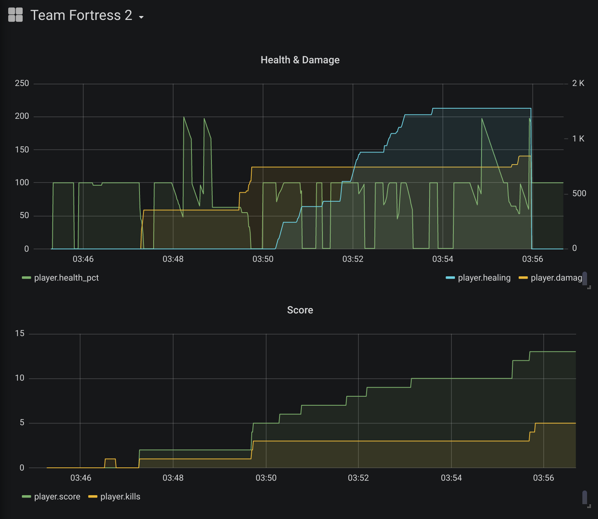

## Prerequisites

You will need multiarch gcc and libstdc++. Prepare the environment:

    git submodule update --init
    make prepare

## Building

Build the agent:

    make

## Using

To enable the InfluxDB collector, use:

    export INFLUXDB="localhost::/write?db=<db>&precision=ms"

(Yes, you can use Grafana with TF2 now. Looks like this.)

Run the agent:

    ./tf2_healslut.elf $(pidof hl2_linux)

Enjoy!
